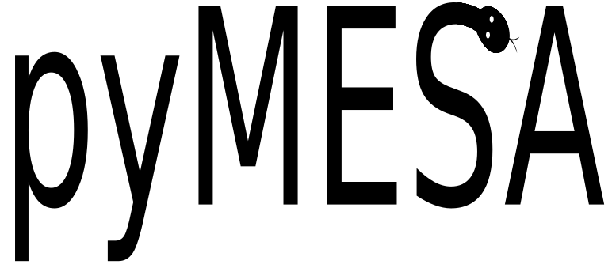

[](https://zenodo.org/badge/latestdoi/98320319)


# pyMesa
Allows python to interface with MESA.


## Requirements:
[gfort2py](https://github.com/rjfarmer/gfort2py) (Available via pip)

numpy

libtool

automake

chrpath

## Building

### SDK's

Grab these sdks first (if you dont use these sdks then you can still build pyMESA but it wont be bit-for-bit)

[linnux sdk](http://www.astro.wisc.edu/~townsend/resource/download/mesasdk/mesasdk-x86_64-linux-20170821.tar.gz)

[mac sdk](http://www.astro.wisc.edu/~townsend/resource/download/mesasdk/mesasdk-x86_64-osx-10.12-20170821.dmg)

### MESA patching

Run the mesa-setup.sh script from this folder, after setting MESA_DIR and initilizing the SDK.

````bash
chmod u+x mesa-setup.sh
./mesa-setup.sh
````

This script should only be run once to setup up mesa. It can be ran again if you do a ./clean inside the MESA_DIR.

Adipls, gyre and stella are not currently built as part of this.

While we can use the inivdual MESA modules we can not currently run a full star (or binary) model, in either python or fortran.

## Supported MESA versions
- 9793

Other versions can be supported upon request.


## Running
````bash
# Set MESA_DIR and initilize the sdk

export LD_LIBRARY_PATH=$MESA_DIR/lib:$LD_LIBRARY_PATH
python3
````

## Usage

Here is a basic example of talking to the const/ module, more advanced versions can be seen in the different .py files shipped.

````python
import pyMesaUtils as pym

# Loads the const module
const_lib,const_def = pym.loadMod("const")

# When calling a function we must either the value we want (for intent in variables) or an empty variable for intent outs.
ierr=0
# Calls a function
res = const_lib.const_init(pym.MESA_DIR,ierr)

# pyMesa module defines a number of useful MESA paths as pym.SOMETHING

# If the call was a subroutine then res is a dict with the intent out variables in there
# else it contains the result of the function call


# Accessing a variable defined in a module is simply:
const_def.mev_to_ergs

# If the variable is not a parameter then you can change it with:
const_def.standard_cgrav = 5.0

# When passing a derived type, you should pass a dict to the function (filled with anything you want set)
x = {}

# Functions accepting arrays should pass a numpy array the size it expects (if the function allocates the array, then just pass an array of size 1)
x = np.zeros(size)

# Arrays inside derived types are unstable at the moment and don't completely work.

````

Function names and module variables are all tab completable.


## Modules that work

- [x] atm.py
- [ ] binary.py
- [x] chem.py
- [ ] colors.py
- [x] const.py
- [x] crlibm.py
- [x] eos.py
- [x] ion.py
- [x] kap.py
- [ ] net.py (partial support)
- [x] neu.py
- [x] rates.py
- [ ] utils.py
- [ ] star.py

## Unistalling

The best bet is just to redownload mesa, during the setup phase we alter alot of files

## Bug reports:

Bug reports should go to the issue tracker on github. Please include mesa version and gfortran version


